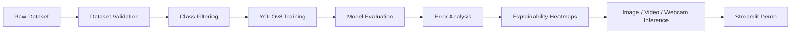

HEAD:README.md
# YOLOv8 PPE Detection

## Real-Time Personal Protective Equipment Detection System

<p align="center">
  
  
  
  
  
</p>

---

## Project Overview

This project is a **YOLOv8-based computer vision system** for detecting personal protective equipment in industrial safety environments.

The project covers the full computer vision workflow:

```text
Dataset Inspection → Data Cleaning → Model Training → Benchmarking → Evaluation → Error Analysis → Explainability → Real-Time Inference → Streamlit Demo
```

It is designed to show practical skills in **computer vision engineering**, not just model training.

---

## Problem Statement

In industrial workplaces, missing safety equipment can lead to serious accidents.

This project detects safety-related objects such as:

* Hardhat
* Safety vest
* Gloves
* Mask
* Person

The system can be used as a prototype for workplace safety monitoring and visual inspection.

---

## Core Workflow



---

## Key Features

* Dataset validation and annotation inspection
* Class filtering from 14 classes to 5 PPE classes
* Dynamic class remapping
* YOLOv8n, YOLOv8s, and YOLOv8m benchmarking
* Precision, recall, mAP50, and mAP50-95 evaluation
* Confidence threshold comparison
* Error analysis for low-confidence and no-detection cases
* Explainability heatmaps
* Image inference
* Video inference
* Webcam inference
* Streamlit-based demo interface

---

## Tech Stack

| Category         | Tools                           |
| ---------------- | ------------------------------- |
| Programming      | Python                          |
| Object Detection | YOLOv8, Ultralytics             |
| Deep Learning    | PyTorch                         |
| Computer Vision  | OpenCV                          |
| Data Handling    | NumPy, Pandas                   |
| Visualization    | Matplotlib                      |
| Demo UI          | Streamlit                       |
| Evaluation       | Precision, Recall, mAP          |
| Explainability   | Heatmap-based visual inspection |

---

## Detected Classes

| Class       | Description                    |
| ----------- | ------------------------------ |
| Hardhat     | Protective helmet detection    |
| Safety Vest | High-visibility vest detection |
| Gloves      | Hand protection detection      |
| Mask        | Face mask detection            |
| Person      | Worker/person detection        |

---

## Model Benchmarking

| Model   | Purpose                             |
| ------- | ----------------------------------- |
| YOLOv8n | Lightweight and fast inference      |
| YOLOv8s | Balanced speed and accuracy         |
| YOLOv8m | Stronger model with higher capacity |

Add your final metrics here:

| Model   | Precision |    Recall |     mAP50 |  mAP50-95 |
| ------- | --------: | --------: | --------: | --------: |
| YOLOv8n | Add value | Add value | Add value | Add value |
| YOLOv8s | Add value | Add value | Add value | Add value |
| YOLOv8m | Add value | Add value | Add value | Add value |

---

## Project Structure

```text
yolov8-ppe-detection/
│
├── app.py
├── README.md
├── requirements.txt
├── .gitignore
│
├── src/
│   ├── image_inference.py
│   ├── video_inference.py
│   ├── webcam_inference.py
│   └── utils.py
│
├── notebooks/
│   └── training_and_evaluation.ipynb
│
├── assets/
│   ├── demo_image.png
│   ├── prediction_output.png
│   └── architecture.png
│
└── docs/
    └── project_notes.md
```

---

## Example Output

```text
Input: Industrial worker image

Detected:
- Person: 0.91 confidence
- Hardhat: 0.87 confidence
- Safety Vest: 0.82 confidence

Safety Interpretation:
Worker appears to be wearing required PPE.
```

---

## How to Run Locally

### 1. Clone Repository

```bash
git clone YOUR-PPE-PROJECT-LINK
cd yolov8-ppe-detection
```

### 2. Create Virtual Environment

```bash
python -m venv .venv
```

### 3. Activate Environment

For Windows:

```bash
.venv\Scripts\activate
```

For macOS/Linux:

```bash
source .venv/bin/activate
```

### 4. Install Requirements

```bash
pip install -r requirements.txt
```

---

## Run Image Inference

```bash
python src/image_inference.py --source path/to/image.jpg
```

---

## Run Video Inference

```bash
python src/video_inference.py --source path/to/video.mp4
```

---

## Run Webcam Inference

```bash
python src/webcam_inference.py
```

---

## Run Streamlit Demo

```bash
streamlit run app.py
```

---

## Results and Evaluation

The project evaluates model performance using:

* Precision
* Recall
* mAP50
* mAP50-95
* Confidence score analysis
* Visual inspection of predictions
* Error case review

Important evaluation checks:

```text
High confidence detections → Good predictions
Low confidence detections → Needs threshold review
No detections → Possible dataset/model limitation
Wrong detections → Class confusion or annotation issue
```

---

## Explainability

This project includes heatmap-style visual inspection to understand where the model focuses during detection.

Explainability is used to review:

* Whether the model focuses on the correct object area
* Whether false detections are caused by background noise
* Whether low-confidence detections are still visually meaningful

---

## What This Project Demonstrates

This project demonstrates:

* Computer vision dataset engineering
* YOLOv8 training and benchmarking
* Object detection evaluation
* Real-time inference using OpenCV
* Streamlit-based demo development
* Explainability for computer vision
* Practical AI project structuring

---

## Limitations

* Webcam performance depends on laptop camera and local hardware
* Detection quality depends on dataset quality and annotation consistency
* Some PPE items may be missed in low-light or crowded images
* Real industrial deployment would require stronger validation and edge-device optimization

---

## Future Improvements

* Add model export to ONNX
* Add edge-device deployment support
* Improve low-light image performance
* Add alert system for PPE violations
* Add cloud deployment
* Add larger industrial safety dataset
* Add stronger real-time dashboard

---

## Recruiter Summary

This project shows a complete computer vision workflow:

```text
Dataset → YOLOv8 Training → Evaluation → Explainability → Real-Time Inference → Demo App
```

It highlights practical skills in:

* Object detection
* Deep learning
* Computer vision engineering
* Model evaluation
* Streamlit demo building
* Real-time inference

---

## Author

**Sreekar**

<p>
  <a href="mailto:sreekar.germany.2025@gmail.com">
    
  </a>
  <a href="https://github.com/Sreekar-1804">
    
  </a>
</p>
LinkedIn: www.linkedin.com/in/sreekar-v/
GitHub: https://github.com/Sreekar-1804
>>>>>>> 20e5a65 (Refactor YOLO PPE project for production deployment):training/README.md
